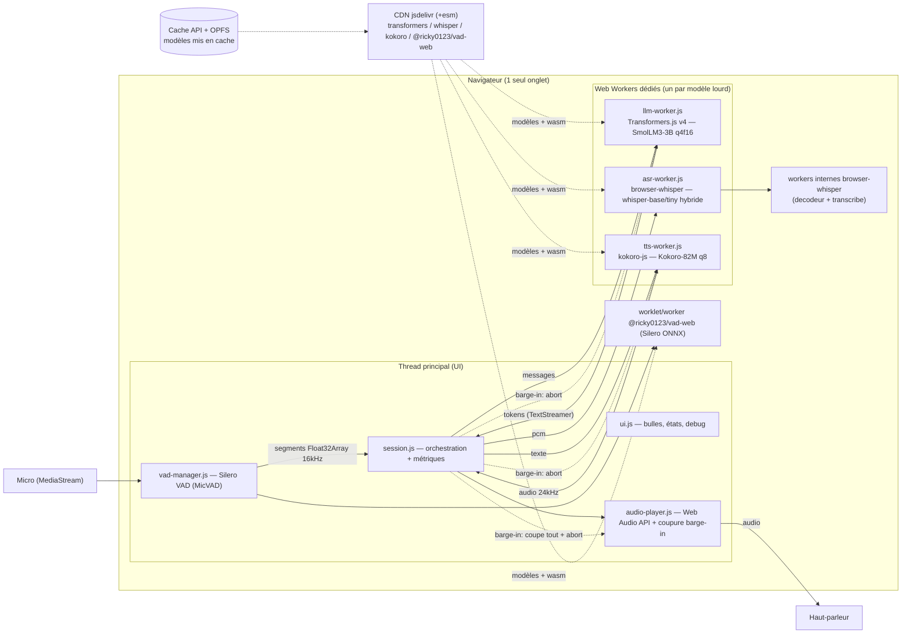
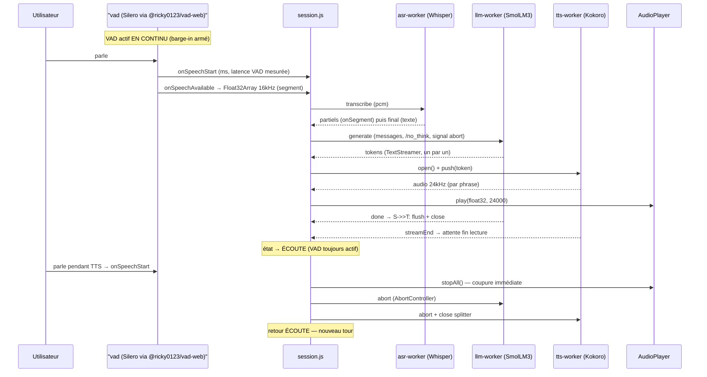

# 📐 Architecture — SmolMLive

Assistant vocal conversationnel **100 % client**, style GPT-Live/Gemini-Live :
`parole → VAD → ASR → LLM (streaming) → TTS (streaming) → audio`, avec **barge-in**
et **latence mesurée à chaque étape**. Aucun backend. Hébergeable sur GitHub Pages (statique).

---

## 1. Vue d'ensemble



Séquence d'un tour :



---

## 2. Tableau des choix techniques (sources vérifiées le 2026-08-01)

| Composant | Choix | Version | Source | Taille téléchargement | Empreinte RAM (estimation — *à mesurer*) |
|---|---|---|---|---|---|
| **LLM** | SmolLM3-3B ONNX q4f16, device `webgpu` (fallback `wasm`), TextStreamer, `/no_think` | Transformers.js **4.2.0** | [HF HuggingFaceTB/SmolLM3-3B-ONNX](https://huggingface.co/HuggingFaceTB/SmolLM3-3B-ONNX) (README : q4f16, no_think, TextStreamer) — tailles via [HF API tree](https://huggingface.co/api/models/HuggingFaceTB/SmolLM3-3B-ONNX/tree/main/onnx) | **2 124 MB** (q4f16) ; q4 = 2 843 MB ; fp16 = 6 167 MB | ≥ 3,5–5 GB (poids 2,1 GB + KV cache + activations). WASM mono-thread : à mesurer ; WebGPU : dépend du buffer GPU |
| **LLM mobile (fallback)** | Qwen2.5-0.5B-Instruct q4f16 | idem | [HF onnx-community/Qwen2.5-0.5B-Instruct](https://huggingface.co/onnx-community/Qwen2.5-0.5B-Instruct) — vérifié existant (SmolLM3-1.7B-ONNX **n'existe pas**, HTTP 401) | **483 MB** | ≈ 0,7–1 GB |
| **ASR** | Whisper via browser-whisper (hybride : encodeur fp32 + décodeur q4), `transcribePCM()` 16 kHz, cache OPFS, fallback WASM | browser-whisper **1.1.0** | [GitHub tanpreetjolly/browser-whisper](https://github.com/tanpreetjolly/browser-whisper) (README : quant hybride défaut, tailles, OPFS, COOP/COEP requis pour threading) | whisper-base ≈ **136 MB** ; whisper-tiny ≈ **64 MB** (README lib) ; détail fichiers : encodeur fp32 82,5 MB + décodeur q4-with-past 121,3 MB (HF API) | ≈ 300–500 MB |
| **VAD** | Silero VAD via @ricky0123/vad-web (MicVAD, AudioWorklet), `MicVAD.new({onSpeechStart, onSpeechRealStart, onVADMisfire, onFrameProcessed, onSpeechEnd, baseAssetPath, onnxWASMBasePath})` + `.start()/.pause()/.destroy()` — `onSpeechEnd(audio)` : Float32Array 16 kHz mono (types publiés) ; partiels ~1 s via accumulation `onFrameProcessed` | @ricky0123/vad-web **0.0.30** (latest npm, 2026-08-01) | [npm @ricky0123/vad-web](https://www.npmjs.com/package/@ricky0123/vad-web) ; [types dist/real-time-vad.d.ts](https://cdn.jsdelivr.net/npm/@ricky0123/vad-web@0.0.30/dist/real-time-vad.d.ts) ; [GitHub ricky0123/vad](https://github.com/ricky0123/vad) | silero_vad_legacy.onnx ≈ **1,8 MB** + worklet 2,5 KB + wasm ORT 1.23.2 (embarqué) | ≈ 50–100 MB |
| **TTS** | Kokoro-82M dtype q8 (wasm) / fp32 (webgpu), streaming `TextSplitterStream` + `tts.stream(splitter, {voice})` — la voix se passe à `stream()` (vérifié dans le bundle v1.2.1 : `stream(e,{voice="af_heart",...})`), **pas** à `from_pretrained` (signature : `{dtype, device, progress_callback}` uniquement) | kokoro-js **1.2.1** | [npm kokoro-js](https://www.npmjs.com/package/kokoro-js) (README : stream, dtypes, voix) ; [HF onnx-community/Kokoro-82M-v1.0-ONNX](https://huggingface.co/onnx-community/Kokoro-82M-v1.0-ONNX) | **86 MB** (dtype q8 — fichier model_q8f16.onnx) ; fp16 = 163 MB ; voix = 0,5 MB | ≈ 200–400 MB |
| Runtime ONNX | onnxruntime-web (embarqué dans Transformers.js v4) | 1.26.0-dev (dépendance transformers 4.2.0) | [npm @huggingface/transformers 4.2.0](https://registry.npmjs.org/@huggingface/transformers/4.2.0) | wasm ≈ 1–2 MB (cache via `env.useWasmCache`) | — |

**Total téléchargement initial (première visite) :**
- Profil desktop (SmolLM3 3B + whisper-base + Kokoro q8 + VAD) : **≈ 2,35 GB**
- Profil mobile (Qwen 0.5B + whisper-tiny + Kokoro q8 + VAD) : **≈ 635 MB**

Tous les fichiers sont mis en cache (Cache API pour Transformers.js / kokoro-js, OPFS pour browser-whisper) → **pas de re-téléchargement entre visites, offline après premier chargement**.

---

## 3. Choix structurants et justifications

### 3.1 SmolLM3-3B n'est PAS viable sur mobile — signalé explicitement
- **Fait vérifié** : le build ONNX officiel `HuggingFaceTB/SmolLM3-3B-ONNX` pèse **2 124 MB en q4f16** (source : HF API). `HuggingFaceTB/SmolLM3-1.7B-ONNX` **n'existe pas** (HTTP 401, 2026-08-01). Aucun build ONNX communautaire SmolLM2 1.7B non plus (401).
- **Conséquences** : sur mobile (RAM onglet souvent 2–4 GB, WASM mono-thread faute de COOP/COEP sur GitHub Pages), le chargement échouera (OOM) ou sera inutilisable. Sur WebGPU, la limite `maxBufferSize` de beaucoup d'appareils ≈ 256 MB–1 GB par buffer : les très gros modèles échouent (voir [issue transformers.js #1056](https://github.com/huggingface/transformers.js/issues/1056) et [guide WebGPU](https://huggingface.co/docs/transformers.js/en/guides/webgpu)). La v4 améliore (GPT-OSS 20B q4f16 tourne sur M4 Pro Max, ~60 tok/s — [release v4.0.0](https://github.com/huggingface/transformers.js/releases/tag/4.0.0)), mais **résultat non garanti selon GPU/appareil → à mesurer localement**.
- **Alternative concrète implémentée** : profil mobile = `onnx-community/Qwen2.5-0.5B-Instruct` q4f16 (**483 MB**, vérifié), échelle de downgrade `desktop-webgpu → desktop-wasm → mobile-webgpu → mobile-wasm`. SmolLM3-3B reste le défaut desktop (qualité/6 langues).

### 3.2 GitHub Pages : pas de COOP/COEP → WASM mono-thread
- GitHub Pages ne permet pas d'en-têtes HTTP personnalisés → `crossOriginIsolated === false` → **pas de SharedArrayBuffer → onnxruntime-web limité à 1 thread** (défaut `env.wasm.numThreads`, voir [doc ORT env-flags](https://github.com/microsoft/onnxruntime/blob/gh-pages/docs/tutorials/web/env-flags-and-session-options.md) et [README browser-whisper](https://github.com/tanpreetjolly/browser-whisper) « Threaded WASM needs cross-origin isolation »).
- **Gestion** : `llm-worker.js` force `env.backends.onnx.wasm.numThreads = 1` si non isolé ; les libs (browser-whisper, @ricky0123/vad-web) ont leur fallback mono-thread. Le code fonctionne mono-thread — performances réduites sur gros modèles (d'où les profils réduits).
- **Contournements possibles (hors GH Pages)** : héberger sur un domaine qui permet les headers (Netlify/Vercel/Render static, `_headers`), ou COOP/COEP via un reverse proxy. Documenté, pas implémenté (contrainte GH Pages).

### 3.3 CDN + chemins relatifs (project pages en sous-dossier)
- Toutes les libs viennent de **jsdelivr `+esm`** (résolution des imports bare, pas de build) : `@huggingface/transformers@4.2.0`, `browser-whisper@1.1.0`, `kokoro-js@1.2.1`, `@ricky0123/vad-web@0.0.30` — URL vérifiées HTTP 200 le 2026-08-01.
- Les workers sont chargés par `new Worker(new URL('./workers/x.js', import.meta.url))` → **chemins relatifs, fonctionne en sous-dossier** (`user.github.io/repo/`) sans config base.
- Modèles : téléchargés depuis huggingface.co par les libs (Transformers.js : `env.allowLocalModels=false`, cache Cache API + `env.useWasmCache`).
- `index.html` : import map uniquement pour le thread principal (les workers n'héritent pas des import maps → URLs absolues `+esm`).

### 3.4 Streaming de bout en bout
- LLM : `TextStreamer` sous-classé → `postMessage` par token (`llm-worker.js`).
- TTS : `TextSplitterStream` + `tts.stream()` → audio par phrase pendant la génération (pas d'attente de réponse complète).
- ASR : segments VAD (Float32Array 16 kHz) → `transcribePCM` (partiels via `onSegment`, final via `collect()`).
- VAD : **actif en continu** (MicVAD ne s'arrête pas entre les tours) → barge-in.

### 3.5 Barge-in
- `onSpeechStart` pendant `speaking`/`processing` → `AudioPlayer.stopAll()` (coupure source Web Audio immédiate), `abort` LLM (AbortController passé à la génération), `abort` TTS (fermeture splitter + flag), purge file ASR, retour `listening`. L'audio partiel déjà généré est gardé dans la bulle.

### 3.6 Modularité (composants remplaçables)
Chaque composant expose une interface étroite :
- **VAD** : `VadManager.start()/stop()` + callbacks (`onSpeechStart`, `onOngoing`, `onSegment`).
- **ASR** : `asr-worker` (init/transcribe/abort) — adaptateur : si browser-whisper échoue, implémentation alternative via pipeline `automatic-speech-recognition` de Transformers.js (même protocole postMessage).
- **LLM** : `llm-worker` (init/generate/abort) — changer de modèle = changer l'entrée `config.js` (pas de code).
- **TTS** : `tts-worker` (init/open/text/flush/close/abort).
Le swap de modèle selon appareil = simple changement de profil dans `js/config.js`.

### 3.7 Détection de capacité / dégradation gracieuse
`device.js` : `navigator.gpu` (WebGPU), `navigator.deviceMemory`, `navigator.hardwareConcurrency`, UA mobile → profil. Erreurs au chargement modèle → `downgradeProfile()` (échelle) + bandeau. Refus micro → message explicite (HTTPS requis, GitHub Pages = HTTPS natif).

---

## 4. Latence — ce qui est mesuré

`Metrics` (js/metrics.js) enregistre par tour (affiché panneau debug + console) :

| Marque | Signification |
|---|---|
| `vad_trigger` | geste → onSpeechStart (VAD Silero) |
| `asr_partial` | onSpeechOngoing → premier partiel ASR |
| `asr_final` | fin segment VAD → transcription finale |
| `llm_first_token` | transcription → premier token LLM |
| `tts_first_chunk` | transcription → premier chunk audio TTS |
| `tts_end` | transcription → fin synthèse |
| `barge_in` | onSpeechStart pendant TTS → coupure |

⚠️ **Aucun benchmark n'est inventé ici.** Les ordres de grandeur dépendent entièrement de l'appareil (GPU, RAM, WASM mono-thread sur GH Pages). Chaque valeur est **à mesurer localement** avec le panneau debug (voir `docs/manual-integration-test.md`).

---

## 5. Risques connus (explicites)

| Risque | Impact | Mitigation |
|---|---|---|
| Mémoire onglet mobile (2–4 GB) | OOM sur SmolLM3-3B (2,1 GB) | Profil mobile Qwen-0.5B (483 MB) + downgrade automatique + message clair |
| Pas de COOP/COEP sur GitHub Pages | WASM mono-thread → LLM lent | Fallback mono-thread fonctionnel ; profils réduits ; alternative Netlify/Vercel documentée |
| WebGPU variable (Chrome 113+ ✓, Firefox 141+ ✓, Safari 18+ ✓ ; mobile Chrome largement, iOS Safari partiel) | Échec ou lenteur | Détection `navigator.gpu` + fallback wasm automatique ; tests on-need |
| `maxBufferSize` WebGPU (256 MB–1 GB selon appareil) | SmolLM3-3B peut refuser de charger sur WebGPU | Downgrade automatique vers WASM ou Qwen-0.5B |
| Premier chargement long (2,35 GB desktop / 635 MB mobile) | Attente avant première interaction | Progression par modèle (panel UI) ; cache persistant ensuite |
| Interruption génération LLM : dépend du support de `signal` dans le runtime | Barge-in pendant génération LLM parfois non immédiat | `abort` posté au worker ; si non honoré → discard après fin (dégradé) ; **à vérifier sur l'appareil cible** |
| browser-whisper crée ses workers internes depuis le bundle CDN | Résolution d'URL des workers selon l'environnement | Adaptateur Transformers.js en secours (même protocole) |
| Transformer.js 4.2.0 dépend d'un onnxruntime-web *dev* (`1.26.0-dev.2026…`) | Stabilité runtime | Pinning exact v4.2.0 ; vérification manuelle incluse au test d'intégration |

---

## 6. Structure du projet

```
smolmlive/
├── index.html              # UI + import map (thread principal)
├── styles.css
├── js/
│   ├── config.js           # profils, modèles, prompts (point de swap)
│   ├── device.js           # détection capacité + downgrade
│   ├── logger.js           # logs structurés (console + panneau)
│   ├── metrics.js          # latences par étape
│   ├── vad-segmenter.js    # logique pure VAD (testée)
│   ├── vad-manager.js      # wrapper @ricky0123/vad-web (MicVAD)
│   ├── audio-player.js     # lecture Web Audio + coupure barge-in
│   ├── session.js          # orchestration pipeline + état
│   ├── ui.js               # DOM mobile-first
│   ├── main.js             # bootstrap
│   └── workers/
│       ├── llm-worker.js   # Transformers.js v4 + TextStreamer
│       ├── asr-worker.js   # browser-whisper (transcribePCM)
│       └── tts-worker.js   # kokoro-js (TextSplitterStream)
├── tests/vad-segmentation.test.mjs   # node:test (9 tests)
├── docs/
│   ├── architecture.md
│   ├── deployment.md
│   └── manual-integration-test.md
├── .github/workflows/deploy.yml      # CI GitHub Pages (statique)
├── README.md
└── CHECKLIST.md
```
